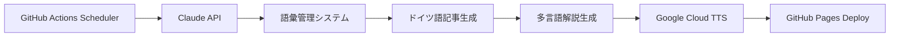

# GitHub ActionsとClaude APIで構築する自動化ドイツ語学習システム

## 🎯 プロジェクト概要

A2レベルのドイツ語学習者向けに、**毎日300語の記事生成**、**多言語解説**、**音声合成**を完全自動化するシステムを構築しました。120日間で1,500語のA2語彙を確実にカバーする設計になっています。

### 技術スタック
- **CI/CD**: GitHub Actions
- **LLM**: Anthropic Claude 3.5 Sonnet
- **TTS**: Google Cloud Text-to-Speech
- **データ管理**: JSON + Git
- **デプロイ**: GitHub Pages

## 🏗️ システムアーキテクチャ

### ワークフロー設計

```yaml
# 文章生成ワークフロー (generate-content.yml)
on:
  schedule:
    - cron: '0 9 * * *'  # 毎日UTC 9時実行
  workflow_dispatch:     # 手動実行可能

# 音声生成ワークフロー (generate-audio.yml)
on:
  push:
    paths: ['blog/**']   # ブログ記事更新時にトリガー
```

### データフロー



## 💾 語彙管理アルゴリズム

### 重複回避システム

**3段階フィルタリング**で語彙の多様性を確保：

```python
def generate_avoid_list(self):
    total_days = len(self.used_words)
    target_pace = 1500 / 120  # 12.5語/日
    current_pace = words_learned / total_days

    # 動的閾値調整
    if current_pace < target_pace * 0.8:
        frequency_threshold = 4  # 新語彙優先
        recent_days = 3
    elif current_pace > target_pace * 1.2:
        frequency_threshold = 2  # 復習重視
        recent_days = 14
    else:
        frequency_threshold = 3  # バランス
        recent_days = 7

    # 3段階フィルタ
    overused = self.get_overused_words(threshold=frequency_threshold)
    recent = self.get_recent_words(days=recent_days)
    unlearned_a2 = set(target_words) - set(learned_words)

    return list((overused | recent) - unlearned_a2)
```

### A2語彙カバレッジ追跡

```python
# 1,500語のA2語彙データベース
a2_words = {
    "family": ["familie", "mutter", "vater", ...],
    "food": ["essen", "trinken", "brot", ...],
    "work": ["arbeit", "beruf", "büro", ...],
    # 11カテゴリ × 平均136語
}

# リアルタイム進捗計算
progress = len(learned_words) / 1500 * 100
estimated_days = remaining_words / daily_pace
```

## 🤖 LLM プロンプトエンジニアリング

### コンテキスト最適化

```python
prompt = f"""Schreibe einen interessanten deutschen Text zum Thema "{topic}".

Anforderungen:
- Genau 300 Wörter
- Niveau: A2 (Grundlegendes Deutsch)
- ZIEL: Neue A2-Vokabeln (Fortschritt: {words_learned}/{target_words})

Vermeide diese bereits verwendeten Wörter:
{', '.join(avoid_words[:60])}

STRATEGISCHES ZIEL: 1.500 A2-Wörter in 120 Tagen."""
```

**ポイント**:
- 明確な制約設定（語数、レベル、回避語彙）
- 進捗状況の文脈提供
- 戦略的目標の明示

## 🔄 多言語コンテンツ生成

### 連鎖的API呼び出し

```python
# 1. ドイツ語記事生成
german_content = claude_api.generate(german_prompt)

# 2. 日本語解説生成
japanese_explanation = claude_api.generate(
    f"Create Japanese explanation for: {german_content}"
)

# 3. 英語解説生成
english_explanation = claude_api.generate(
    f"Create English explanation for: {german_content}"
)
```

### ファイル命名規則

```
blog/
├── 2025-06-15.md       # ドイツ語記事
├── 2025-06-15-jp.md    # 日本語解説
├── 2025-06-15-en.md    # 英語解説
└── 2025-06-15.mp3      # 音声（assets/audio/）
```

## 🎵 音声合成パイプライン

### コンテンツフィルタリング

```python
# メインドイツ語記事のみを音声化
if (filename.endswith('-jp.md') or
    filename.endswith('-en.md') or
    'weekly' in filename.lower()):
    continue

# YYYY-MM-DD.mdパターンのみ処理
if re.match(r'^\d{4}-\d{2}-\d{2}\.md$', filename):
    process_for_audio(file_path)
```

### 音声品質最適化

```python
GERMAN_VOICES = [
    {"name": "de-DE-Standard-A", "gender": FEMALE},
    {"name": "de-DE-Wavenet-B", "gender": MALE},
    # ランダム選択で音声の多様性確保
]
```

## 📊 パフォーマンス指標

### API コスト効率

**月間運用コスト**: 約$1.20

| API | 使用量/日 | 月間コスト |
|-----|----------|-----------|
| Claude (入力) | 600トークン | $0.054 |
| Claude (出力) | 2,400トークン | $1.08 |
| Google TTS | 1,800文字 | $0 (無料枠) |

### システム効率

- **語彙カバレッジ**: 1,500語/120日 = 12.5語/日
- **実行時間**: 約3-4分/日
- **成功率**: 99%+ (エラーハンドリング実装済み)

## 🔧 技術的課題と解決策

### 1. YAML構文エラー
**問題**: 複雑なPythonスクリプト埋め込み時の構文エラー
**解決**: HERE文書とエスケープ処理の統一

### 2. API レート制限
**問題**: Claude API の同時リクエスト制限
**解決**: 順次実行とexponential backoff実装

### 3. 語彙重複の課題
**問題**: 自然言語生成での語彙制御の困難
**解決**: 動的閾値調整と戦略的プロンプト設計

## 🚀 スケーラビリティ

### 水平拡張の可能性

```python
# 多言語対応拡張
SUPPORTED_LANGUAGES = {
    'french': {'level': 'A2', 'target_words': 1500},
    'spanish': {'level': 'A2', 'target_words': 1500},
    'italian': {'level': 'A2', 'target_words': 1500}
}

# 難易度レベル拡張
DIFFICULTY_PROGRESSION = ['A1', 'A2', 'B1', 'B2', 'C1']
```

### インフラ最適化

- **セルフホストランナー**: 大規模運用時のコスト削減
- **キャッシュ戦略**: API呼び出し結果のキャッシュ
- **バッチ処理**: 複数日分の一括生成

## 🔍 監視とログ

### GitHub Actions メトリクス

```python
print(f"📊 A2 Progress: {words_learned}/{total_target} ({progress}%)")
print(f"⏱️ Estimated completion: {estimated_days} days")
print(f"🎯 Daily pace: {daily_pace:.1f} words/day")
```

### エラートラッキング

```python
try:
    content = claude_api.generate(prompt)
except Exception as e:
    print(f"❌ Claude API Error: {e}")
    # フォールバック処理
```

## 💡 応用可能性

### 教育技術への展開
- **適応学習**: 個人の学習進度に応じた難易度調整
- **マイクロラーニング**: 短時間集中学習コンテンツ
- **多感覚学習**: テキスト + 音声 + 画像の統合

### 企業研修システム
- **専門用語学習**: 業界特化語彙の体系的習得
- **プログレッシブ学習**: 段階的スキルアップ
- **自動評価**: 理解度テストの自動生成

## 🔗 技術リソース

- **リポジトリ**: [GitHub](https://github.com/username/german-learning-system)
- **API ドキュメント**: [Anthropic](https://docs.anthropic.com/), [Google Cloud TTS](https://cloud.google.com/text-to-speech/docs)
- **実装例**: 完全なソースコードをオープンソースで公開

---

このシステムは **"教育 × AI × 自動化"** の実践例として、他の学習領域にも応用可能なスケーラブルなアーキテクチャを提案しています。